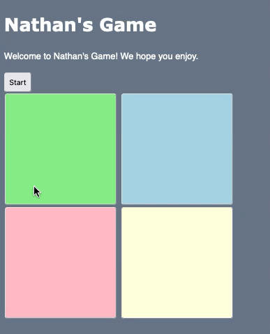

## If you used any outside resources to help complete your submission (websites, books, people, etc) list them here.
I didn't use any resources outside of the documentation provided.

## What was a challenge you encountered in creating this submission (be specific)? How did you overcome it? (recommended 200 - 400 words)
I accidently capitalized my buttons which confused me later when the javascript section didn't work for the over game design. After stepping through my code in the console, I realized that this was because I the getElementById function woudn't work because of my earlier typo. The steps I took to overcome this challenge were to look through my code for any obvious errors, look through the documentation for debugging help, and then finally using the console to determine what my mistake was. 

## What questions about web development do you have after completing your submission?
I'm a little confused on what the different sound functions do and how they work. I'll spend more time researching this later.

## If you had a few more hours to work on this project, what would you spend them doing (for example: refactoring certain functions, adding additional features, etc). Be specific.
First of all, I think I would spend some time debugging my current project as sometimes will mark the correct choice incorrect and I didn't have time to figure out how to fix that. Secondly, I think I would try to add some of the additional features such as multiple lives. Finally, I think it would be really cool to work further on the backend of the system with some sort of database to save high scores. 

## Interview Recording URL Link
[My 5-minute Interview Recording](https://drive.google.com/file/d/14mTSjOHYRZGn1Hb-G5vK_qRBBB1UN6Hi/view?usp=sharing)

## Project gif
